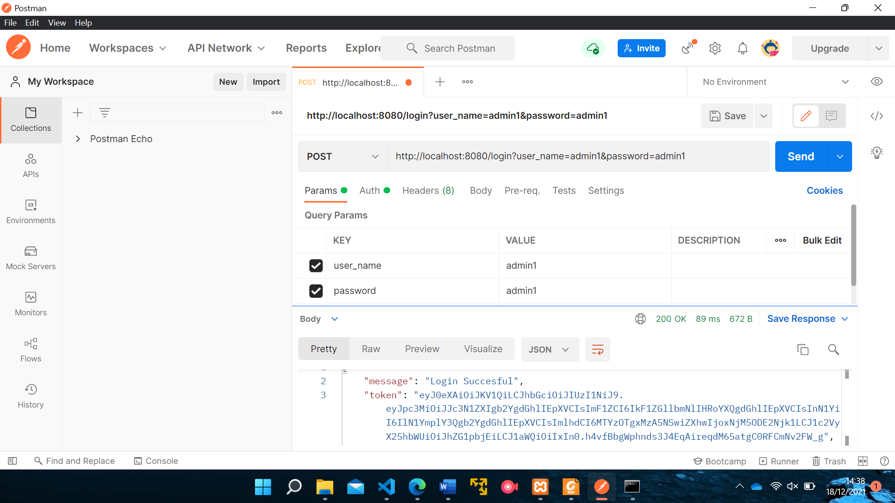
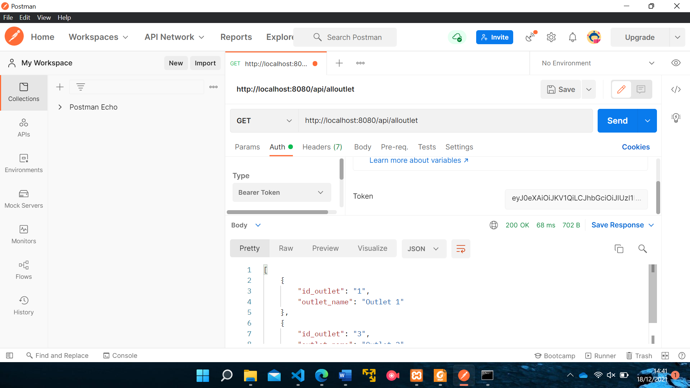

# About this project
This is transaction from merchant and outlet report sites that build with codeigniter 4 and authentication using jwt

### Login example


### Fetch data example


# How to run Locally

## Requirement
1. Make sure you already have php 7.4 or above, webserver (apache or nginx),and mysql installed on your computer
2. Make sure you already install composer

## Installation steps
1. Clone this repo to your local computer
2. Enter to root project folder
3. Edit your .env file (copy from env copy file), fit with your configuration setting for database and app.url
4. Create new database
5. Run composer instal
```
composer install
```
6. Run migration
```
php spark migrate
```
7. Run local development server
```
php spark serve
```